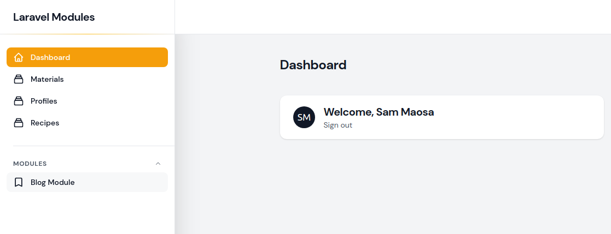
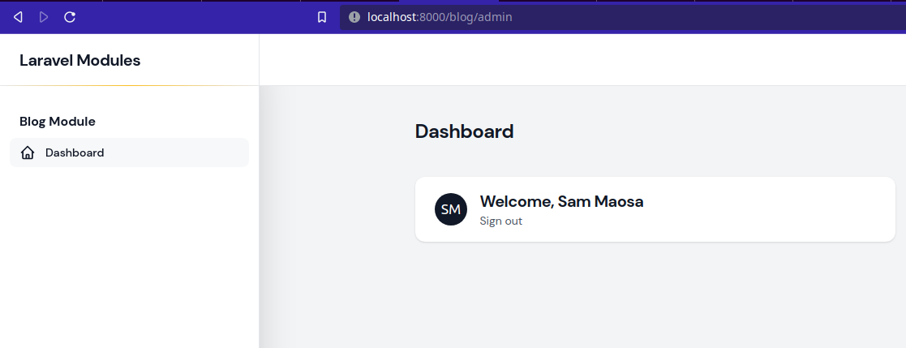
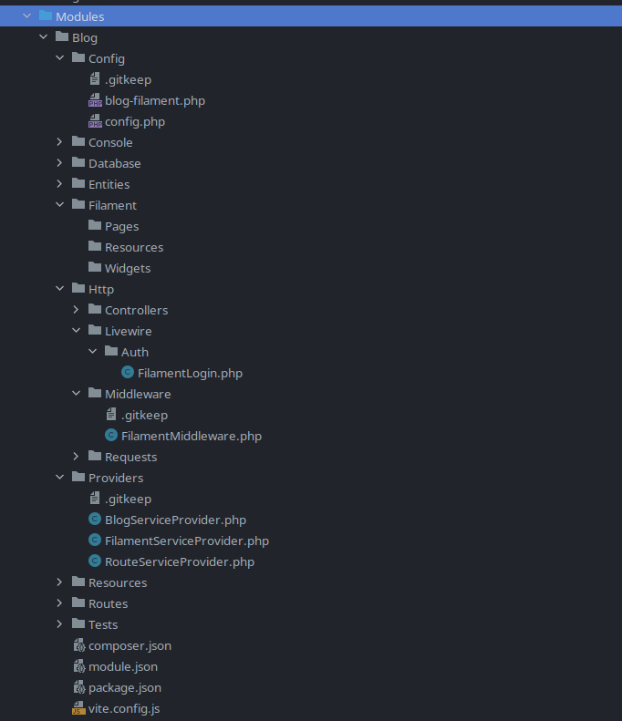

# Use FilamentPHP with nwiDart/laravel-modules

[](https://packagist.org/packages/savannabits/filament-modules)
[](https://github.com/savannabits/filament-modules/actions?query=workflow%3Arun-tests+branch%3Amain)
[](https://github.com/savannabits/filament-modules/actions?query=workflow%3A"Check+%26+fix+styling"+branch%3Amain)
[](https://packagist.org/packages/savannabits/filament-modules)




This plugin provides you with a quick and working configuration to install multiple filament admin contexts in your modular laravel app (using [laravel-modules](https://github.com/nWidart/laravel-modules)).

## Goal
The goal of this app is to enable you install multiple contexts of Filament Admin per module in your LaravelModules powered app.

For example, if you have two modules (**Blog** and **Pos**), you should be able to have filament installed in each module with separate resources as below:
- Directory **Modules/Blog/Filament** should enable you to access the admin panel via `http://yoururl/blog/admin`
- Directory **Modules/Pos/Filament** should enable you to access the admin panel via `http://yoururl/pos/admin`
- We can even have another context under **Modules/Pos/Filament2** should enable you to access the admin panel via `http://yoururl/pos/admin2` or whichever path you configure for that context.

Each of the above directories should have their own distinct **Pages, Resources** and **Widgets**. Each of them also has a config under the module's Config folder allowing you to customize a number of parameters per context, e.g the `path`.
Additionally, each of these can have its own customized login page which redirects back to the module.

You can read more about Multiple Context for Filament [Here](https://github.com/iotronlab/filament-multi-guard).

If this is your goal, then you are in the right place.
 
## Installation
Before you proceed, this guide assumes that you have configured your app fully to work with Laravel Modules. If you haven't, follow the [Laravel Modules Docs](https://docs.laravelmodules.com/v9/installation-and-setup) before proceeding.

You can install the package via composer:

```bash
composer require savannabits/filament-modules
```

## Usage

To generate a new Filament Context, use the `module:make-filament-context` command.
You can run `php artisan module:make-filament-context -h` to see the expected arguments.

```bash
#Option 1: Pick an existing module to use first, then run the command (similar to other laravel-modules commands)
php artisan module:use Blog
php artisan module:make-filament Filament # This will create the `Filament` filament context inside the Blog module.
php artisan module:make-filament Accounting # This will create the `Accounting` filament context inside the Blog module.

# Option 2: Pass the Module name as an argument. If the module does not exist, it will be automatically created.
php artisan module:make-filament Filament Blog # This will create the `Filament` filament context inside the Blog module.
php artisan module:make-filament Accounting Blog # This will create the `Accounting` filament context inside the Blog module.
```
### Directory Structure of the generated module:

### Config:
The configuration for each of the generated contexts will be stored under the module's Config directory, e.g `/Modules/Blog/Config/blog-filament.php` in the above case.
You can adjust the config to change several parameters, for example the admin panel path (defaults to the slug of the context name).

### The context's admin panel path
By default, you should be able to access your admin panel under the url `http://yoururl/:yourModule/:yourPathConfig` 
e.g `http://yoururl/blog/admin-panel` and `http://yoururl/blog/accounting` in the above cases.
If you would like to change the path, you can change it under the corresponding config file.

### The Context's Service Provider
This package automatically adds each of the generated context's service provider in providers' list in `app.php config`.
Be sure to remove this Service Provider in case you delete the context.

## Adding Pages/Resources/Widgets/RelationManagers to Module Context

You may now add filament resources in your FilamentTeams directories. 
```bash
#Generating Resources:
## Default Context if not passed: Filament
## If module is not passed, it will default to the currently being used module or ask for a prompt to input the module name.
php artisan module:make-filament-resource {name?} {context?} {module?} {--soft-deletes} {--view} {--G|generate} {--S|simple} {--F|force}

#Generating Pages
## Default Context if not passed: Filament
## If module is not passed, it will default to the currently being used module or ask for a prompt to input the module name.
php artisan module:make-filament-page {name} {context?}  {module?} {--R|resource=} {--T|type=} {--F|force}

#Generating RelationManagers:
php artisan module:make-filament-relation-manager {resource?} {relationship?} {recordTitleAttribute?} {context?} {module?}  {--attach} {--associate} {--soft-deletes} {--view} {--F|force}

#Widgets: Pass the Module name as an argument and the name of widget.
php artisan module:make-filament-widget {module?} {name?} {--R|resource=} {--C|chart} {--T|table} {--S|stats-overview} {--F|force}

```

### ContextualPage & ContextualResource traits (DEPRECATED)

__NB__: In the latest update you don't need to include these traits since the routing has been modified to be 
specific to a module and a context using the slug.

Pages (DEPRECATED):

```php
namespace YourNamespace\Resources;

use Savannabits\FilamentModules\Concerns\ContextualPage;
use Filament\Pages\Page;

class Dashboard extends Page
{
    use ContextualPage;
}
```

Resources (DEPRECATED):

```php
namespace YourNamespace\Resources;

use Savannabits\FilamentModules\Concerns\ContextualResource;
use Filament\Resources\Resource;

class UserResource extends Resource
{
    use ContextualResource;
}
```

## Testing

```bash
composer test
```

## Changelog

Please see [CHANGELOG](CHANGELOG.md) for more information on what has changed recently.

## Contributing

Please see [CONTRIBUTING](.github/CONTRIBUTING.md) for details.

## Security Vulnerabilities

Please review [our security policy](../../security/policy) on how to report security vulnerabilities.

## Credits

- [Sam Maosa](https://github.com/savannabits)
- [All Contributors](../../contributors)

## License

The MIT License (MIT). Please see [License File](LICENSE.md) for more information.
